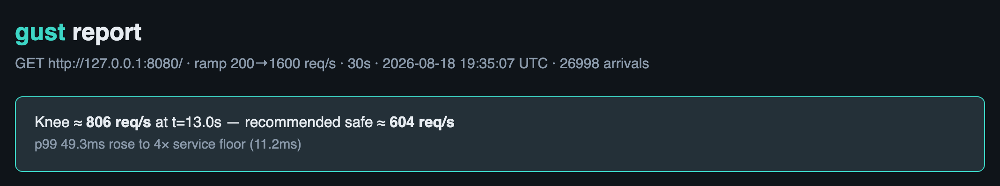
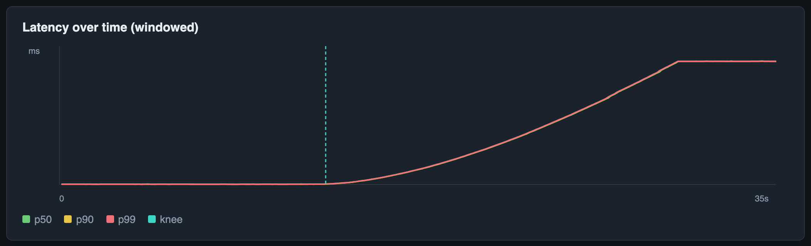

# Gust

**Find where your system falls apart.**

Gust is a load-testing studio: point it at an API, ramp up traffic, and watch
the system break in real time — latency distributions spreading, p99 detaching
from p50, throughput flattening while errors climb. It is built in Rust because
a load generator is one of the few tools where *the tool itself* must not be the
bottleneck, and it is designed so the degradation is beautiful to watch, not
just a summary table.

## Why this exists

The category is occupied — k6, Vegeta, `oha`, `rlt`, Goose. None of them win on
being *nice to use*. k6 prints a table. JMeter is ancient Java. The terminal
tools are fast but terminal-only. Gust's bet is the same one TablePlus made
against free SQL clients and `foley` made against other UI-sound libraries:
**win an occupied category on craft, not on novelty.** The differentiator is a
gorgeous, legible view of a system degrading under load.

## The one thing Gust gets right on day one: coordinated omission

Most load testers lie about latency. When a target stalls, a naive tester stops
sending requests and never records the latency those blocked-but-never-sent
requests would have seen — so the distribution looks *best* exactly when the
system is at its worst. This is *coordinated omission* (Gil Tene's term).

Gust uses an **open-model scheduler**: it fires requests on a fixed wall-clock
schedule regardless of whether earlier ones have come back, and it corrects the
histogram against the intended send interval. Every run reports **raw vs
corrected** percentiles side by side. The gap between them is the latency your
users actually feel.

## Try it

Gust ships a demo API that falls apart for a real reason: it serves requests
from a fixed-size pool, so once arrivals outpace capacity, requests queue.
Nothing is faked — the knee you see is genuine queueing.

```bash
# Terminal 1 — a target that saturates near ~720 req/s (pool 8, ~11ms effective service):
node examples/demo-api.js

# Terminal 2 — ramp straight through the breaking point:
cargo run --release -p gust -- run http://127.0.0.1:8080/ \
  --profile ramp --from 200 --to 1600 --duration 30 \
  --report ./gust-report.html
```

Other things you can point it at:

```bash
# Live dashboard (default) at a constant rate:
cargo run --release -p gust -- run http://127.0.0.1:8080/ --rate 200 --duration 10

# Plain summary for scripts / CI:
cargo run --release -p gust -- run http://127.0.0.1:8080/ --rate 200 --duration 10 --no-ui

# Weighted mix of endpoints with different costs:
cargo run --release -p gust -- run --scenario examples/demo-mix.toml \
  --profile ramp --from 50 --to 500 --duration 25

# Multi-step journey with think-time:
cargo run --release -p gust -- run --scenario examples/journey.toml --rate 50 --duration 20

# Method / headers / body:
cargo run --release -p gust -- run http://127.0.0.1:8080/api/items \
  --method POST --header "Content-Type: application/json" --body '{"ok":true}'

# Bearer / Basic / cookies (demo `/api/me` requires one of these):
cargo run --release -p gust -- run http://127.0.0.1:8080/api/me \
  --bearer demotoken --rate 50 --duration 5 --no-ui
cargo run --release -p gust -- run http://127.0.0.1:8080/api/me \
  --basic-auth demo:demo --rate 50 --duration 5 --no-ui

# Login → protected API via cookie jar:
cargo run --release -p gust -- run --scenario examples/auth-journey.toml \
  --cookie-jar --rate 20 --duration 5 --no-ui
```

### Answer the capacity question: "how much load fits my SLO?"

Most load testers hand you percentiles and let you eyeball a chart. Gust turns a
p99 budget into the number you actually provision for — the **max req/s that
holds under your SLO**:

```bash
cargo run --release -p gust -- run http://127.0.0.1:8080/ \
  --profile ramp --from 100 --to 1200 --duration 20 --no-ui \
  --slo-p99-ms 50
```

```
  SLO:       p99 ≤ 50ms sustains ≈ 840 req/s (797 served) at t=13.5s
```

It appears in the summary, the HTML banner, and — because it is saved in the
JSON artifact — in `gust compare`, so a capacity fix reads as a single line:

```
  SLO capacity (req/s)      427.068 →    839.965  (improved, Δ +412.897)
```

### Save a run, gate CI, prove a fix

```bash
# JSON artifact (plus optional HTML)
cargo run --release -p gust -- run http://127.0.0.1:8080/ \
  --profile ramp --from 200 --to 1600 --duration 30 --no-ui \
  --json ./run.json --report ./run.html

# Fail the process if corrected p99 / error rate / knee miss the contract
cargo run --release -p gust -- run http://127.0.0.1:8080/ \
  --rate 600 --duration 8 --no-ui \
  --max-p99-ms 50 --max-error-rate 0.01 --min-success-rate 0.99

# After you change the system: compare baseline → candidate (exit 1 on regress)
cargo run --release -p gust -- compare ./baseline.json ./after.json

# Markdown for a PR comment, or JSON for tooling
cargo run --release -p gust -- compare ./baseline.json ./after.json --format md
cargo run --release -p gust -- compare ./baseline.json ./after.json --format json

# Rebuild HTML from a saved artifact
cargo run --release -p gust -- report ./run.json -o ./run.html
```

`--format md` renders a table a CI job can drop straight onto the pull request:

```
### gust compare

**Verdict: ✅ IMPROVED**

| metric | baseline | candidate | Δ | |
| --- | ---: | ---: | ---: | :--- |
| corrected p99 (ms) | 4943.871 | 1887.231 | -3056.640 | improved |
| error rate | 0.496 | 0.000 | -0.496 | improved |
| knee (req/s) | 411.946 | 808.506 | +396.560 | improved |
| SLO capacity (req/s) | 427.068 | 839.965 | +412.897 | improved |
```

Drop [`examples/gust-perf-gate.yml`](examples/gust-perf-gate.yml) into
`.github/workflows/` to run this on every PR: it posts the table as a comment
and fails the check on a regression.

Walkthrough with real before/after numbers (pool 4 → pool 8 on the demo API):
[`docs/CASE-STUDY.md`](docs/CASE-STUDY.md).

### Plain-English diagnosis

Every finished run now includes a written verdict — not just numbers. Gust
names the failure mode (*latency saturation*, *throughput collapse*, *error
spike*, *dead target*, or *healthy*) and explains what to do next:

```
  diagnosis: Throughput collapsed near ≈ 304 req/s — the system could not keep up with arrivals. (throughput collapse)
    · knee ≈ 304 req/s at t=1.5s — p99 73.7ms (4× service floor) and throughput 34% of target
    · recommended safe load ≈ 228 req/s (75% of knee)
    · SLO p99 ≤ 50ms sustains ≈ 304 req/s
    · peak in-flight ≈ 5165 requests

  Offered load outran completions: throughput flattened while the intended send
  rate kept climbing. That is classic backpressure — a bounded pool, saturated
  CPU, or a downstream bottleneck that cannot absorb arrivals.
```

Re-run the diagnosis from a saved artifact:

```bash
cargo run --release -p gust -- diagnose ./run.json
```

The live dashboard shows throughput, in-flight depth, the cumulative raw-vs-corrected
percentile table, latency over time, and a knee banner when the break is detected.
Press `q` to stop.

### What the report looks like

A ramp against the demo API (200 → 1600 req/s, 30s) lands a knee near
**806 req/s** and recommends **~604 req/s** as a safe operating load — close to
the measured ~720 capacity, a little high because a ramp does not dwell:





Longer walkthrough with the throughput chart and the coordinated-omission
angle: [`docs/KNEE.md`](docs/KNEE.md).

Real output from the weighted mix above, against the demo API:

```
gust: ramp 50→500 req/s for 25s · demo-mix (3 steps, Weighted)

  arrivals:  6873
  completed: 6873
  success:   6873 (100.0%)
  failure:   0 (0.0%)

  latency (ms)      raw     corrected
  min               9.11          2.02
  p50              30.46        184.45
  p90             446.46        498.94
  p99             742.91        689.66
  p99.9           787.46        756.22
  max             805.89        805.89

  knee:      ≈ 457 req/s at t=22.9s (p99 315.4ms (6× baseline) and throughput 83% of target)
  safe load: ≈ 343 req/s (75% of knee)
```

Read the p50 row twice. A naive tester reports a **30ms median**; the
coordinated-omission correction says users actually waited **184ms**. That gap
is the whole point.

For multi-endpoint scenarios, Gust also breaks latency out **by step** (slowest
corrected p99 first), so you can see which route was holding the pool:

```
  by step (slowest corrected p99 first)
  step                  n      p50      p99   p99 corr
  checkout             63     50.3     51.6       51.4
  search              192     30.9     32.0       31.9
  items               384     10.9     11.8       11.8
```

### Does the knee detection actually work?

The demo API's capacity is measurable, so you can check Gust against ground
truth. A constant-rate sweep (`--rate R --duration 8 --no-ui`) shows exactly
where pool-8 falls apart — latency sits at the ~11ms service floor until
arrivals outrun the pool, then p99 climbs an order of magnitude:

| Rate | raw p99 | Verdict |
| --- | --- | --- |
| 700 req/s | ~11 ms | healthy |
| 750 req/s | ~25 ms | queueing starts |
| 800 req/s | ~180 ms | over capacity |
| 850 req/s | ~670 ms | saturated |

So the real breaking point is **~720 req/s** — close to `pool ÷ effective
service time` (8 ÷ 11ms ≈ 727), and about 10% under the naive `8 ÷ 10ms = 800`
ceiling because Node's single-threaded event loop adds ~1ms per request.

On a *ramp*, Gust reports a single knee near this band. The exact number is
a little higher than the sweep (~800–870 vs ~720) because a ramp does not dwell
long enough at each rate for the queue to fully form — treat it as "≈ where it
breaks" and the *recommended* load (75% of knee) as the number to operate under.
Across back-to-back runs the ramp knee stays in a tight band; it no longer
swings to ~2× capacity when a prior run left the target still queueing.

## Architecture

```
gust/
├── AGENTS.md            # handoff for other worktrees / agents (start here)
├── docs/                # PLAN, ARCHITECTURE, DECISIONS, STATUS, HANDOFF, KNEE, CASE-STUDY + images
├── examples/            # demo-api.js (capacity-limited target) + scenarios
├── crates/
│   ├── gust-core/       # pure measurement — no I/O, no async, unit-tested
│   └── gust-cli/        # binary — open-model scheduler + reqwest + TUI
└── Cargo.toml
```

The engine is kept free of I/O on purpose: the coordinated-omission logic is the
subtle part, so it is tested without a network (`cargo test -p gust-core`).

**Continuing elsewhere?** Read [`AGENTS.md`](./AGENTS.md) then [`docs/HANDOFF.md`](./docs/HANDOFF.md).

## Roadmap

- **P0 (done):** constant-rate open-model run against one URL; raw vs corrected
  HDR percentiles.
- **P1 (done):** live TUI — windowed p50/p90/p99 chart so the tail visibly
  detaches from the median, throughput readout, and a percentile table that
  flags coordinated-omission gaps.
- **P2 (done):** ramping load profiles; automatic breaking-point (knee)
  detection; self-contained HTML report via `--report`.
- **P3 (done):** TOML scenarios (sequence journeys + weighted mix); in-flight
  backpressure chart; `--method` / `--header` / `--body` on single-URL runs.
- **Compare / CI (done):** `--json` run artifacts; `gust compare`; `gust report`;
  `--max-p99-ms` / `--max-error-rate` / `--min-success-rate` / `--min-knee-rps`
  / `--require-knee` exit gates. See [`docs/CASE-STUDY.md`](docs/CASE-STUDY.md).
- **SLO capacity (done):** `--slo-p99-ms` reports the max load that holds under a
  p99 budget; flows into compare.
- **Auto-diagnosis (done):** plain-English cause + narrative on every run;
  `gust diagnose <run.json>`.
- **P4 (only if a real need appears):** distributed generators across machines
  with correctly-merged histograms — the one place a coordination layer earns
  its keep.

## Writing material

Start with [`docs/KNEE.md`](docs/KNEE.md) — a short, numbers-backed walkthrough
of finding the breaking point on the demo API. Then
[`docs/CASE-STUDY.md`](docs/CASE-STUDY.md) — baseline → fix → `gust compare`
with a clear IMPROVED verdict. Each phase is also a post: coordinated omission
and why averages lie (P0), rendering a distribution going bimodal the moment a
pool exhausts (P1), detecting the knee (P2), regression-aware load testing
(compare/CI), merging HDR histograms across machines without corrupting
percentiles (P4).

## License

MIT OR Apache-2.0.
