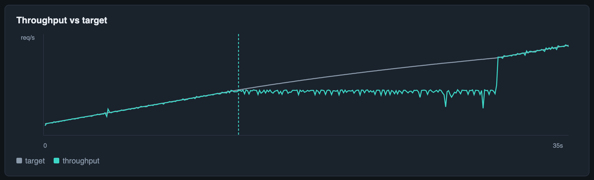

# How Gust found the knee

A short walkthrough of what Gust is for, using the demo API that ships with the
repo. No mocks — these numbers are from a real ramp against
`examples/demo-api.js`.

## Setup

```bash
# Terminal 1 — pool of 8, ~11ms effective service → breaks near ~720 req/s
node examples/demo-api.js

# Terminal 2 — climb straight through the breaking point
cargo run --release -p gust -- run http://127.0.0.1:8080/ \
  --profile ramp --from 200 --to 1600 --duration 30 \
  --report ./gust-report.html
```

The demo is not a sleep that "pretends" to fail. Each request takes a slot from
a fixed-size pool; once arrivals outpace the pool, requests queue and latency
stops tracking service time. That is the same failure mode a real connection
pool or worker pool shows.

## What Gust reported

On one run (2026-08-18):

| | |
| --- | --- |
| Load | ramp 200 → 1600 req/s over 30s |
| Arrivals | 26,998 |
| Knee | **≈ 806 req/s** at t=13.0s |
| Recommended safe load | **≈ 604 req/s** (75% of knee) |
| Reason | p99 49.3ms rose to 4× the 11.2ms service floor |

The constant-rate sweep in the README puts the true break closer to **~720
req/s**. A ramp sits a little high because it does not dwell long enough at each
rate for the queue to fully form — treat the knee as "≈ where it breaks" and
the recommended load as the number to operate under.


## What the chart shows


For the first ~13 seconds, windowed p50/p90/p99 sit on the service floor
(~11ms). Past the knee marker, latency climbs without bound while the target
rate keeps rising — the classic hockey stick. That vertical teal line is Gust
saying: *this is the last load the system was still surviving.*



Throughput tracks the ramp until capacity, then flattens near the pool's
limit while the intended send rate keeps climbing. The gap between the two
lines is backpressure made visible.

## Why raw vs corrected matters here

Once the target is saturated, an open-model generator keeps firing on schedule
even while earlier requests are still outstanding. Coordinated-omission
correction fills the histogram with the waiting those arrivals would have
seen. On this run the raw p50 was ~1.8s and the corrected p50 ~2.0s — both
awful once past the knee, and both honest about how bad it got. A closed-model
tester that waits for each response before sending the next would have painted
a friendlier picture of the same meltdown.

## Takeaway

Gust's job is not "send a lot of HTTP." It is to **name the load where your
system stops being itself**, and to show the evidence in a report you can
share. Point it at your API the same way; the demo just makes the ground truth
checkable.
